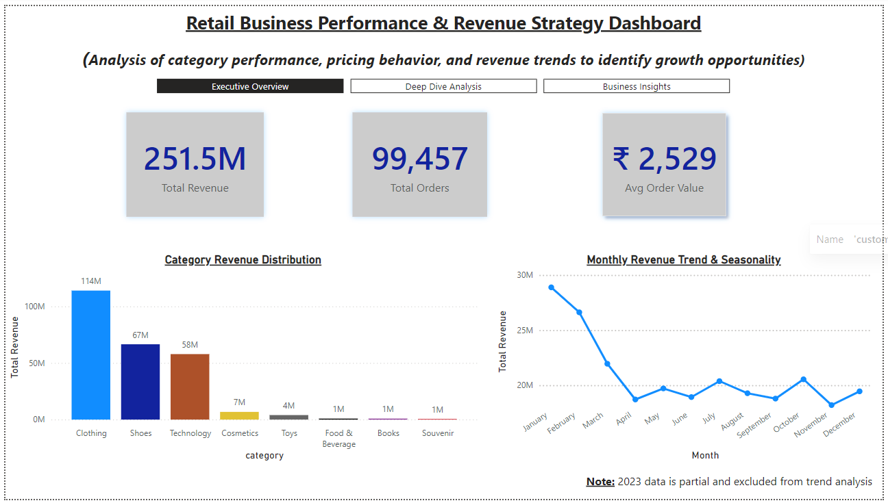
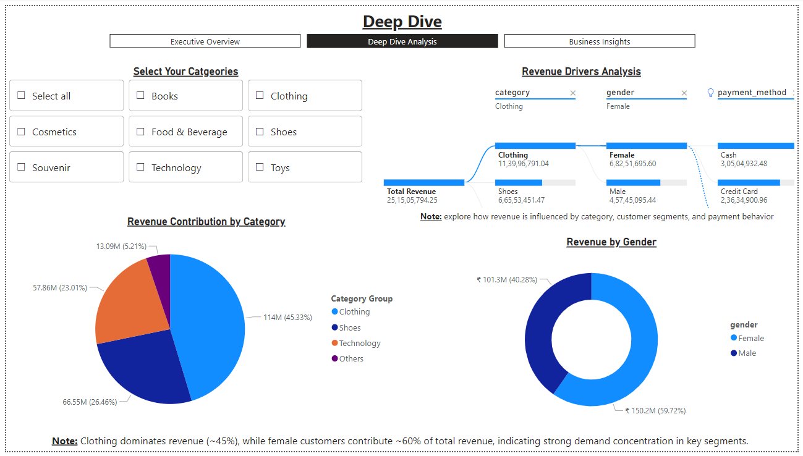
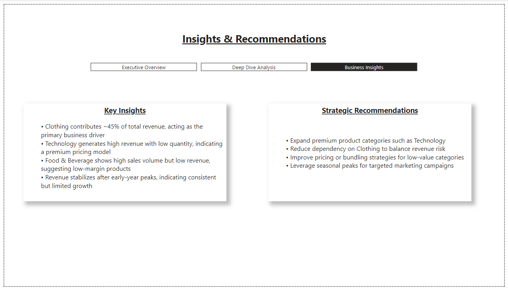

# Retail Business Performance & Revenue Strategy Dashboard

## Overview

This project analyzes retail transaction data to evaluate business performance, identify revenue drivers, uncover hidden patterns, and provide actionable strategic recommendations.

The workflow follows a structured approach:
Data Exploration (Excel) → Data Modeling (Power BI) → Interactive Dashboard → Business Insights

---

## Problem Statement

The objective of this project is to analyze multi-category retail transaction data in order to:

* Evaluate overall business performance
* Identify high-performing and underperforming categories
* Analyze revenue trends over time
* Understand customer segments and purchasing behavior
* Discover patterns influencing revenue generation
* Provide data-driven business recommendations

---

## Tools and Technologies

* Power BI (Data modeling, visualization, DAX)
* Microsoft Excel (Exploratory data analysis)
* DAX (Measures and calculations)

---

## Project Structure

```id="n8r4x1"
Retail-Business-Performance-Dashboard/
 ┣ data/
 ┃ ┗ customer_shopping_data.xlsx
 ┣ dashboard/
 ┃ ┗ retail_dashboard.pbix
 ┣ images/
 ┃ ┣ excel_analysis.png
 ┃ ┣ dashboard_overview.png
 ┃ ┣ deep_dive.png
 ┃ ┗ insights.png
 ┗ README.md
```

---

## Data Exploration (Excel)

Initial analysis was conducted in Excel to validate data and identify early patterns. The following areas were explored:

* Category-wise revenue distribution
* Quantity analysis across categories
* Pricing behavior and average price trends
* Monthly revenue trends
* Preliminary business insights

### Excel Analysis


---


---


---


---


---

## Dashboard Overview

### Page 1: Executive Overview

This page provides a high-level summary of business performance.

* Key Performance Indicators:

  * Total Revenue
  * Total Orders
  * Average Order Value
* Revenue distribution by category
* Monthly revenue trend and seasonality



---

### Page 2: Deep Dive Analysis

This page enables detailed and interactive exploration.

* Category slicer for dynamic filtering
* Revenue contribution by category (pie chart with grouped categories)
* Revenue by gender
* Revenue Drivers Analysis using decomposition tree

The decomposition tree breaks down revenue as follows:

Total Revenue → Category → Gender → Payment Method



---

### Page 3: Insights and Recommendations

This page summarizes key findings and business strategies.



---

## Key Performance Indicators

* Total Revenue: 251.5 Million
* Total Orders: 99,457
* Average Order Value: 2,529

---

## Key Business Insights

### Revenue Concentration

The top three categories contribute approximately 95 percent of total revenue, with Clothing alone accounting for around 45 percent. This indicates a high dependency on a single category.

---

### Premium Segment Performance

The Technology category generates high revenue with relatively low quantity, indicating a premium pricing structure.

---

### Volume vs Value Imbalance

Food and Beverage shows high transaction volume but contributes relatively low revenue, suggesting low-margin products.

---

### Customer Segment Contribution

Female customers contribute approximately 60 percent of total revenue, highlighting a dominant customer segment.

---

### Payment Behavior

Cash transactions exceed credit card usage, indicating a preference for traditional payment methods.

---

### Seasonal Trend Pattern

Revenue peaks during early months and stabilizes later, indicating seasonal purchasing behavior.

---

## Hidden Insights

### Revenue Dependency Risk

The business is highly dependent on the Clothing category, increasing risk exposure.

---

### Limited Growth Trend

Revenue stabilizes after initial peaks, indicating limited expansion or scaling.

---

### High-Value Opportunity

Technology category presents strong potential for expansion due to high revenue contribution per unit.

---

### Pricing Optimization Scope

Low-value categories such as Cosmetics and Food & Beverage present opportunities for pricing and bundling improvements.

---

## Revenue Drivers Analysis

A decomposition tree was implemented to analyze revenue at multiple levels:

Total Revenue → Category → Gender → Payment Method

This enables:

* Identification of key revenue-driving categories
* Understanding of dominant customer segments
* Analysis of payment preferences

This approach supports deeper analytical insights beyond basic visualization.

---

## Strategic Recommendations

* Expand premium categories such as Technology
* Reduce dependency on Clothing to balance risk
* Improve margins in low-value categories
* Leverage seasonal demand for targeted campaigns
* Promote digital payment adoption
* Diversify category portfolio for sustainable growth

---

## Dashboard Preview

### Executive Overview


### Deep Dive Analysis


### Insights and Recommendations


---

## Key Learnings

* End-to-end data analysis workflow
* Business-focused dashboard design
* Advanced Power BI features (decomposition tree, slicers)
* KPI structuring and storytelling
* Converting data into actionable insights

---

## Author

Adheje B
